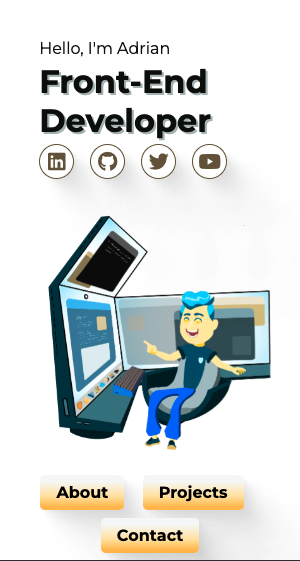

# Portfolio Website

Welcome to my Front End Developer Portfolio repo. Visit the deployment of this site [adriansseur.github.io/portfolio](https://adriansseur.github.io/portfolio) to see my projects.

## Motivation

I built this portfolio to show potential employers what I can do using front end tools like React, Javascript, CSS, HTML, and many others further specified in my portfolio itself.

## Description

Built using React, React Scroll, and custom animated drawings and animations made by me.

## Further Work

I plan on making a second version eventually.